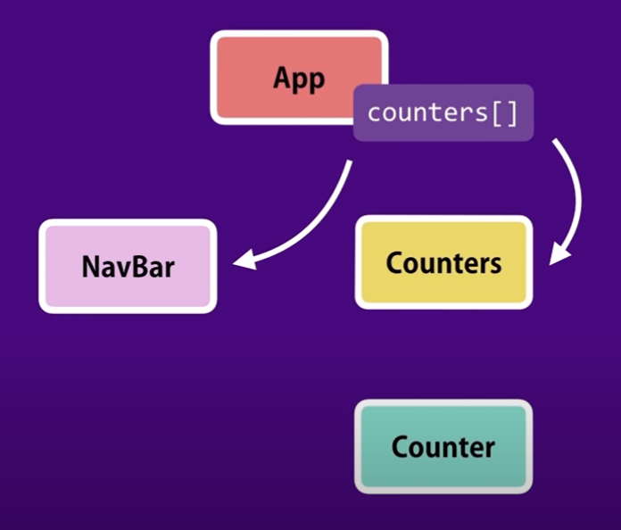
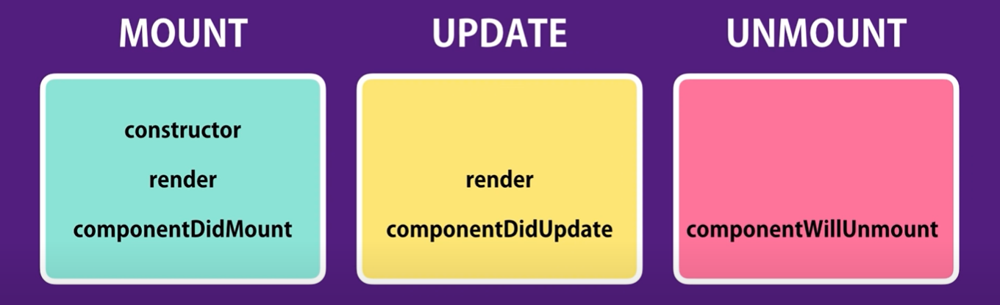

# React
Learning React - https://reactjs.org/</br>

## React JS YT Tute's
React JS - React Tutorial for Beginners with Mosh - https://www.youtube.com/watch?v=Ke90Tje7VS0</br>
### Commands
First React App
```
npm i -g create-react-app@1.5.2

nvm use 16.17.0
nvm alias default 16.17.0

mkdir demo
cd demo
npx create-react-app@latest react-app
```

Output :
```
Success! Created counter-app at /home/robq/repos/react/demo/react-app
Inside that directory, you can run several commands:

  npm start
    Starts the development server.

  npm run build
    Bundles the app into static files for production.

  npm test
    Starts the test runner.

  npm run eject
    Removes this tool and copies build dependencies, configuration files
    and scripts into the app directory. If you do this, you can’t go back!

We suggest that you begin by typing:

  cd counter-app
  npm start

Happy hacking!
```

Install Bootstrap
```
npm i bootstrap@4.1.1
```

Start the App
```
cd react-app
npm start
```
Components and Flow</br>

</br>
Frequent Lifecycle Hooks (Methods)</br>

</br></br></br>

# React Pluralsight Stuff
React 17: Getting Started - https://www.pluralsight.com/courses/react-js-getting-started</br>
React Commonly Faced Problems - https://jscomplete.com/learn/react-beyond-basics/react-cfp</br>
Creating a development environment - https://jscomplete.com/learn/1rd-reactful</br>
How to configure Git to ignore files - https://docs.github.com/en/get-started/getting-started-with-git/ignoring-files</br>

## Commands for React
For the original reactful run (in two seperate terminals) :
```
npm run dev:bundler
npm run dev:server
```
For the npx-reactful :
```
mkdir npx-reactful
cd npx-reactful
npx reactful star-match
cd star-match

#Start the app:
npm start

#Run all tests:
npm test
```
</br></br>
## Some other node / npm / nvm / npm / react Stuff

- https://www.javascripttutorial.net/nodejs-tutorial/npm-list/
- https://www.oddicles.net/blog/npx-create-react-app-not-working-heres-the-solution/
- https://github.com/Quackers71/nodejs/blob/master/README.md
- https://chrome.google.com/webstore/detail/react-developer-tools/fmkadmapgofadopljbjfkapdkoienihi?hl=en
- https://getbootstrap.com/docs/5.2/components/navbar/
- https://github.com/jsx-eslint/eslint-plugin-jsx-a11y/blob/HEAD/docs/rules/anchor-is-valid.md
